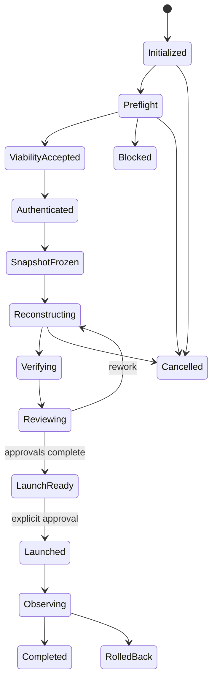
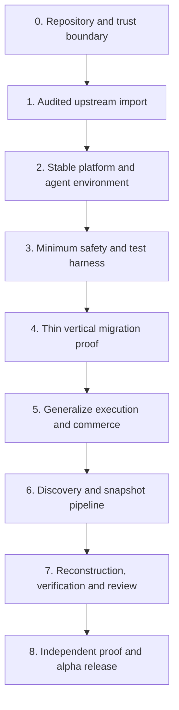
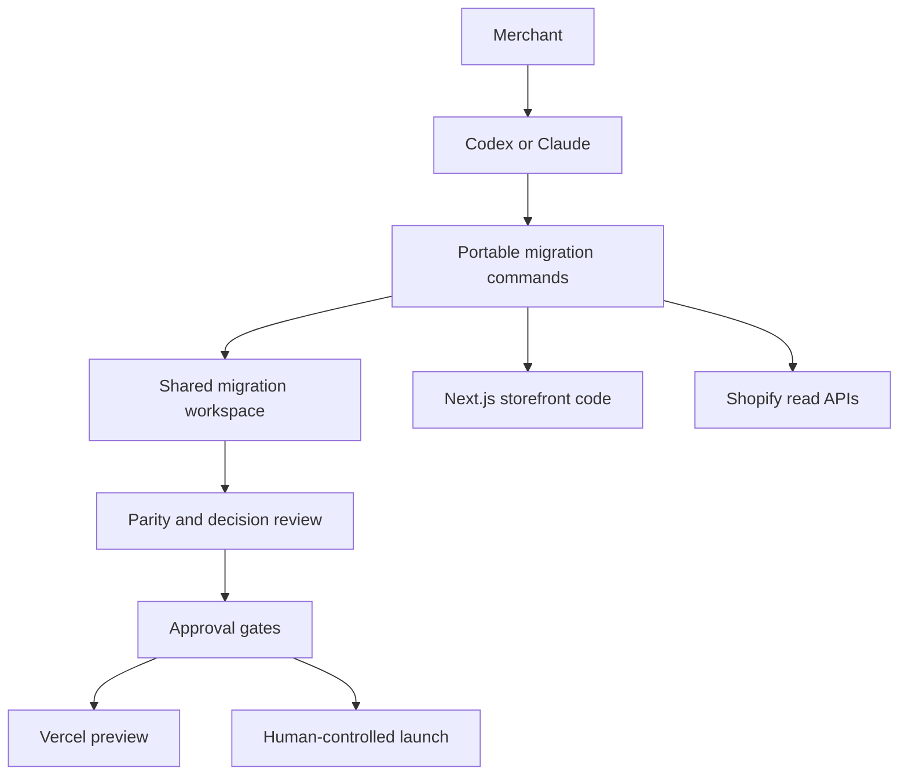

# feat: Build the autonomous Shopify starter foundation

## Overview

Build a clean-room, best-practice Shopify storefront starter that combines a pinned, stabilized Vercel
Shop runtime with a host-neutral autonomous migration system. The product must let an eligible merchant
provide a public storefront URL, published theme source, and narrowly scoped Shopify credentials; then
let a coding agent discover, reconstruct, verify, and prepare the store for a human-gated launch.

Vercel Shop is the runtime foundation, not the finished product. It already supplies modern commerce,
rendering, caching, Base UI, SEO, Shopify operations, and agent guidance. This plan adds the missing
clean-room controls, stable dependency policy, test architecture, migration execution kernel,
discovery/reconstruction pipeline, durable evidence and approvals, and release proof.

## Problem Frame

Established merchants will not trust an autonomous migration based on screenshots and prose alone.
They need an evidence-backed faithful-parity process that can stop safely, resume after interruption,
explain unsupported behavior, protect credentials, and preserve approved URLs and interactions. The
migration agent never performs a live merchant, Admin, deployment, tracking, domain or cutover mutation
without current explicit approval. Buyer-initiated Storefront cart mutations are governed by the
storefront commerce contract and do not require migration approval (see origin:
`docs/requirements/2026-07-11-agentic-shopify-starter.md`).

The template must also remain genuinely generic. Merchant content, assets, theme files, snapshots,
credentials, and Git history cannot enter the distributable repository. Generic capability is imported
from a pinned upstream or reimplemented from behavior-level specifications only.

## Requirements Trace

| Plan area                                       | Origin requirements |
| ----------------------------------------------- | ------------------- |
| Faithful parity and exceptions                  | R1-R3               |
| Staged URL/theme/API onboarding                 | R4-R8               |
| Discovery, route coverage and viability         | R9-R13              |
| Commerce, UI and page foundation                | R14-R19             |
| Skills and host portability                     | R20-R23             |
| Verification, approval and launch               | R24-R30             |
| Security and downstream lifecycle               | R31-R37             |
| Autonomous execution contract                   | R38-R46             |
| Conditional modules and runtime hardening       | R47-R48             |
| Trust boundaries, merchant UX and product proof | R49-R55             |

## Scope Boundaries

- Initial eligibility is a publicly reachable, standard Online Store 2.0 storefront with one published
  theme, hosted Shopify checkout, bounded routes/assets, and no required wholesale or authenticated
  storefront surface.
- Vercel is the supported initial deployment target. Runtime portability is desirable but not a first
  release launch guarantee.
- Customer accounts preserve the existing hosted Shopify account destination. Headless customer
  accounts are an optional capability.
- The upstream shopper-facing AI assistant is excluded from the invariant starter. It is distinct from
  coding-agent migration autonomy.
- Synthetic fixtures are for tests and component/browser scenarios only. Production never falls back
  silently to demo products.
- Intentionally excluded parity items may reach launch only through individual risk-described approval.
  Security failures, WCAG 2.2 AA failures in migrated customer journeys, cart/checkout correctness
  failures, and unresolved URL loss are non-waivable. Revenue-critical templates and capabilities must
  have zero unsupported exclusions.
- No Shopify Admin writes, production deploy, domain attachment, DNS change, tracking activation, or
  cutover occurs autonomously.
- The first public release is an experimental alpha with a published, pre-registered compatibility
  matrix and manual eligibility review. A general recommendation requires several independent
  migrations and at least one consented production cutover with an observation window.

### Deferred to Separate Tasks

- Multi-tenant hosted onboarding service
- Non-Vercel launch adapters
- B2B/wholesale, custom checkout, loyalty, wishlist, pickup and advanced personalization modules
- Runtime shopper assistant
- Additional coding-agent hosts beyond Codex and Claude Code

## Context & Research

### Relevant Code and Patterns

- Pinned upstream source: `vercel/shop` at
  `04a29f8276598e58ec28e74218f38601f6203470`.
- Import from upstream `apps/template/` through an allowlist and provenance manifest; do not use the CLI
  path that downloads a mutable `main` branch.
- Preserve upstream layering: route orchestration → operation → Shopify request → transform → domain
  type → component.
- Preserve Server Components by default, leaf client islands, Server Actions for mutations, Cache
  Components for catalogue/content, request-bound cart work behind Suspense, and geometry-preserving
  fallbacks.
- Reimplement only behavior-level lessons from merchant references. No merchant application file is
  copied.

### Institutional Learnings

- Magic collection/menu handles make first-run stores silently empty; discovery and configuration must
  be data-driven.
- Cart foundations must recover from missing, expired and completed cart IDs, expose Shopify
  `userErrors` and warnings, invalidate cache after every successful mutation, and avoid analytics on
  failed mutations.
- Shopify pagination must be cursor-based from the start; fixed `first: 100` queries truncate real
  stores silently.
- Route parity includes redirects, variant query state, legacy sitemap URLs, canonicals, account and
  checkout handoffs, and redirect chain/cycle detection.
- Purchase tracking remains on Shopify checkout; the storefront owns events only through checkout
  initiation unless a separately approved server-side bridge exists.

### External References

- [Vercel Shop documentation](https://www.vercel.shop/docs)
- [Next.js Cache Components](https://nextjs.org/docs/app/getting-started/partial-prerendering)
- [Next.js 16 upgrade guide](https://nextjs.org/docs/app/guides/upgrading/version-16)
- [shadcn Base UI default](https://ui.shadcn.com/docs/changelog/2026-07-base-ui-default)
- [Shopify API versioning](https://shopify.dev/docs/api/usage/versioning)
- [Shopify client credentials](https://shopify.dev/docs/apps/build/authentication-authorization/access-tokens/client-credentials-grant)
- [Vercel deployment protection](https://vercel.com/docs/deployment-protection)

## Key Technical Decisions

| Decision              | Resolution                                            | Rationale                                                                                                               |
| --------------------- | ----------------------------------------------------- | ----------------------------------------------------------------------------------------------------------------------- |
| Upstream              | Pinned `vercel/shop` template subtree                 | Current architecture already matches Next 16, Base UI and Shopify best practice.                                        |
| Dependency channel    | Stable releases only by default                       | Confidence-first merchants should not inherit canary, preview or `unstable` runtime dependencies.                       |
| Shopify API           | Explicit `2026-07` Storefront and Admin schemas       | Shopify supports dated versions for a bounded window and can silently fall forward.                                     |
| Agent substrate       | CLI + versioned JSON + shared files                   | Portable across coding agents, testable, resumable and independent of optional MCP.                                     |
| Agent tools           | Atomic commands composed by playbooks                 | Preserves agent judgment without hiding safety or approval logic inside a mega workflow.                                |
| Runtime state         | Ignored `.migration/<run-id>/` workspace              | User and agent share evidence while sensitive merchant data stays out of Git.                                           |
| UI primitives         | shadcn `base-nova` + Base UI 1.6                      | Current stable default; freeze only after behavior-focused parity tests.                                                |
| Accounts              | Hosted handoff initially                              | Lowest-risk parity boundary and avoids preview Hydrogen coupling.                                                       |
| Deployment            | Vercel first                                          | Cache Components, protected previews and launch verification can be guaranteed there first.                             |
| Optional capabilities | Discovery-triggered modules                           | Keeps the invariant core excellent without pretending every store uses every feature.                                   |
| Credential boundary   | OS-backed broker outside the agent-writable workspace | Raw Admin credentials must not be available through prompts, files, environment variables or child processes.           |
| Approval boundary     | Human-authenticated, signed decision envelopes        | Agent-writable files and hashes cannot prove human authorization.                                                       |
| Generated code        | Unprivileged quarantine before execution              | Hostile storefront evidence must not gain credential, filesystem or unrestricted network access through generated code. |
| Review surface        | Separate local-only package by default                | Migration evidence and controls must not ship in the production storefront.                                             |
| Downstream topology   | Separate private generated-store repository           | Merchant material never enters foundation history; only sanitized reimplementation can flow back.                       |

## Open Questions

### Resolved During Planning

- **Can approved exclusions launch?** Yes, individually with durable risk acceptance; never in bulk.
- **What freezes source truth?** Successful authenticated discovery creates immutable snapshot `v1`;
  later captures create new versions and invalidate only dependent approvals/checks.
- **Where can Admin secrets appear?** Only in the local credential broker/runtime process, never prompts,
  reports, migration JSON, screenshots or Git.
- **Does the starter inherit the upstream assistant and accounts?** No; both are optional and excluded
  from the invariant import.
- **Which agent hosts launch first?** Codex and Claude Code, validated against the same black-box suite.

### Deferred to Implementation

- Unit 6 must pre-register a conservative provisional product, route, redirect, asset, locale and
  integration envelope before a proving merchant is selected. Proving migrations validate and tighten
  the envelope; they cannot define it retrospectively.
- Exact rich-HTML sanitizer allowlist will be selected after cataloguing Shopify page and product HTML
  fixtures.
- Exact visual-diff tolerance and performance budgets will be calibrated against the neutral fixture
  store, then tightened before the independent migration.
- Any stable-Next incompatibility in the pinned upstream will be resolved during import; a canary
  exception requires a dated ADR and removal condition.

### Provisional Product Proof Scorecard

- Credential-free preflight reaches a useful recommendation within 30 minutes of valid URL/theme input.
- An eligible alpha migration reaches launch readiness within five calendar days, with no more than four
  hours of active merchant effort; actual agent time, retries and token/tool cost are reported.
- At least 90% of discovered shared route templates are reconstructed without manual code repair, and
  100% of revenue-critical routes and buyer-path capabilities pass without unsupported exclusions.
- The proving report records required merchant decisions, rework cycles, support interventions and every
  screened-out candidate. These are product hypotheses to validate, not promises to hide failures behind.

## Output Structure

```text
app/                         Next.js routes and orchestration
components/
  ui/                       source-owned Base UI primitives
  commerce/                 invariant commerce composition
  sections/                 reusable source-triggered sections
lib/
  cart/                     universal/server/action cart boundaries
  shopify/                  fetch, operations, transforms and generated types
  seo/                      routes, redirects, metadata and structured data
  security/                 runtime trust boundaries
migration/
  cli/                      host-neutral atomic commands
  context/                  trusted dynamic context generation
  decisions/                proposal and approval state
  discovery/                crawl, theme and Shopify evidence collectors
  ledger/                   redacted append-only observability
  schemas/                  versioned run and artifact contracts
  state/                    checkpoints, locks and invalidation
  verification/             parity checks and report assembly
packages/
  review/                   local-only evidence and approval application
agent-workflows/             canonical playbooks and host adapters
tests/
  fixtures/                 synthetic public/theme/API evidence
  unit/
  integration/
  browser/
  agent-evals/
scripts/
  clean-room/               contamination and provenance checks
  upstream/                 exact-SHA audited import/update tooling
docs/
  adr/
  compatibility/
  provenance/
  runbooks/
```

## High-Level Technical Design

> _This illustrates the intended approach and is directional guidance for review, not implementation
> specification. The implementing agent should treat it as context, not code to reproduce._



Each state transition writes a checkpoint and redacted ledger event. Every artifact contains schema
version, run ID, source/foundation/input hashes, provenance and sensitivity. Approvals bind to snapshot,
preview, check and evidence hashes; changes invalidate affected approvals automatically.

The diagram models phases. A separate run outcome is always one of `success`, `partial`, `blocked`,
`cancelled`, `rolled_back` or `completed`; phase and outcome are never conflated.

The canonical merchant journey is URL/theme preflight → viability/advisability result → scoped credential
handoff → discovery progress and unknowns → reconstruction preview → parity decisions → launch readiness →
human-controlled launch or exit. Every step defines merchant-visible status, available actions, required
decisions, recovery guidance, cancellation and resume behavior.

## Implementation Units



- [x] **Unit 0: Establish the repository and trust boundary**

**Goal:** Make the fresh repository, remote and security topology real before application code arrives.

**Dependencies:** None

**Approach:**

- Select MIT, run initial contamination/provenance checks, create the audited first commit, create the
  private remote and verify `main` as its default branch.
- Specify the OS-keychain-backed credential broker, authenticated allowlisted local IPC, revocation and
  host guarantees. Raw credentials never enter agent-visible environment variables, arguments, files,
  stdout or child processes.
- Specify the human-authenticated local approval service. It signs immutable, expiring decision
  envelopes binding actor, action, environment, source, preview, evidence and check hashes; privileged
  apply boundaries verify them independently.
- Define untrusted PR, preview, protected branch, release and production secret boundaries.

**Verification:** The repository has an uncontaminated private default branch and implementable trust
boundaries that an ordinary coding agent cannot bypass by editing workspace files.

- [x] **Unit 1: Import an audited Vercel Shop baseline**

**Goal:** Establish a reproducible clean-room application baseline without merchant history or mutable
upstream inputs.

**Requirements:** R14-R19, R22, R36-R37

**Dependencies:** None

**Files:**

- Create: `LICENSE`, `UPSTREAM.md`, `docs/provenance/vercel-shop.json`
- Create: `scripts/upstream/import.mjs`, `scripts/upstream/verify.mjs`
- Modify: `README.md`, `.gitignore`, `docs/TASKS.md`
- Import allowlisted application files into `app/`, `components/`, `lib/` and root configuration

**Approach:**

- Download the exact upstream commit, verify repository/commit/license, calculate file checksums and
  import only the approved `apps/template` allowlist.
- Preserve starter-owned governance documents.
- Exclude shopper-agent and preview-dependent headless-account surfaces. Replace generic metadata assets
  with explicitly licensed synthetic neutral assets or generated metadata routes.
- Record every imported, excluded and subsequently modified file.

**Execution note:** Start with a failing standalone `scripts/upstream/verify.mjs` check before importing
the subtree. Move the same assertions into Vitest after Unit 3 establishes the harness.

**Patterns to follow:**

- `CLEAN_ROOM.md`
- Upstream `apps/template/LICENSE` and route/operation/transform architecture

**Test scenarios:**

- Happy path: exact repository and commit with valid checksums imports only allowlisted files.
- Error path: mutable ref, wrong commit, changed checksum or missing license aborts without partial
  import.
- Security: excluded assistant/account files and binary assets cannot enter through a broad glob.
- Idempotency: running the same import twice produces no diff.

**Verification:**

- Repository contains a runnable generic baseline, complete MIT attribution and no merchant-specific
  material or inherited Git history.

- [x] **Unit 2: Stabilize the platform and agent environment**

**Goal:** Convert the upstream lab template into a pinned, supported, reproducible foundation for
non-technical users and coding agents.

**Requirements:** R19-R23, R37, R43, R46

**Dependencies:** Unit 1

**Files:**

- Modify: `package.json`, `pnpm-lock.yaml`, `next.config.ts`, `components.json`, `.env.example`
- Create: `.node-version`, `shop.config.ts`, `docs/adr/0001-platform-baseline.md`
- Create: `agent-workflows/manifest.json`, `agent-workflows/canonical/*.md`
- Create: `.conductor/settings.toml`, `.worktreeinclude`
- Create: `tests/unit/config-contract.test.ts`, `tests/agent-evals/host-manifest.test.ts`

**Approach:**

- Pin stable Next 16.2.10, React 19.2.7, Base UI 1.6.0, Shopify API 2026-07 and compatible stable
  dependencies. Replace Hydrogen's Storefront client with a direct typed GraphQL transport preserving
  locale context, trusted buyer-IP forwarding, annotations, API-version checks and structured GraphQL
  errors; remove Hydrogen only after no runtime import remains. A temporary preview exception must be
  dated and removal-bound.
- Enable Cache Components and codify catalogue/content versus request-bound/cart caching boundaries.
- Install a curated, pinned skill manifest and generate thin Codex/Claude/Conductor adapters from the
  canonical playbooks.
- Add shared Conductor setup and isolated `CONDUCTOR_PORT` run scripts after the default branch is
  pushed.

**Test scenarios:**

- Happy path: clean install, codegen and production build succeed on the pinned Node/pnpm versions.
- Contract: requested and observed Shopify API versions match 2026-07.
- Error path: canary, preview, `unstable` or deprecated Next patterns fail policy checks.
- Portability: Codex and Claude adapters reference the same canonical commands, schemas and completion
  protocol.

**Verification:**

- A clean checkout has deterministic dependencies, complete environment documentation, working build,
  Base UI configuration and discoverable agent guidance.

- [ ] **Unit 3: Establish the minimum safety and test harness**

**Goal:** Establish the minimum deterministic gates needed to run an early migration slice safely.

**Requirements:** R3, R22, R24-R27, R31-R35, R48

**Dependencies:** Unit 2

**Files:**

- Create: `vitest.config.ts`, `playwright.config.ts`
- Create: `tests/fixtures/**`, `tests/integration/**`
- Create: `scripts/clean-room/scan.mjs`, `scripts/security/deprecated-patterns.mjs`
- Create: `.github/workflows/ci.yml`, `.github/dependabot.yml`
- Create: `tests/clean-room/upstream-import.test.ts`
- Test: `tests/unit/security/*.test.ts`, `tests/clean-room/*.test.ts`

**Approach:**

- Add unit, integration and minimal browser scaffolding; defer surface-specific visual, axe, Lighthouse
  and failure-injection gates until the commerce and review surfaces exist.
- Enforce secret/prohibited-content scans, binary allowlist, license/provenance validation and generated
  artifact isolation across the Git index/history, build output, public assets, workflow artifacts,
  package tarball and release archive—not only `.gitignore`.
- Freeze lockfile installs, disable lifecycle scripts by default with an audited exception list, pin
  Actions by commit, use least-privilege workflow permissions, scan dependencies/secrets, and generate
  SBOM/provenance for releases.
- Define a generated-code quarantine: ephemeral sandbox, no broker socket or secrets, read-only evidence,
  restricted mounts/network, no lifecycle scripts, dependency/script/endpoint/subprocess/dynamic-code/
  secret-read/network-destination checks before execution.
- Separate untrusted no-secret PR tests from credentialed protected-branch/release checks.

**Test scenarios:**

- Security: absent/invalid webhook secret, malicious HTML, bad domain and replayed webhook are rejected.
- Clean-room: seeded secret, merchant phrase, unapproved binary or migration artifact fails CI.
- Quarantine: generated code cannot read host secrets, reach the broker, add an unreviewed package script
  or contact an unexpected destination.
- Supply chain: mutable Action refs, an unapproved lifecycle script or release job with broad permissions
  fails policy.

**Verification:**

- CI blocks unsafe, unlicensed, untested or contaminated changes and provides the harness for the first
  migration slice.

- [ ] **Unit 4: Prove a thin vertical migration slice**

**Goal:** Validate the product premise and artifact boundaries before generalizing a framework.

**Requirements:** R1-R13, R24-R28, R38-R45

**Dependencies:** Units 2 and 3

**Files:**

- Create: minimal `migration/schemas/*`, `migration/cli/*`, `migration/state/*`
- Create: a disposable synthetic downstream fixture and a separate private proving-store checkout
- Test: `tests/integration/vertical-slice.test.ts`

**Approach:**

- Implement only `doctor`, `preflight`, `snapshot`, `status`, `decision`, `verify` and `resume` with the
  minimum versioned file/JSON contract needed for one path.
- In a disposable downstream workspace, take URL + theme source through preflight, one home template, one
  product template and one collection template, reconstruction, deterministic comparison and signed
  decision review. Manual orchestration is acceptable; hidden steps and unverifiable claims are not.
- Run a non-technical first-use test from README through a seeded setup error to the credential-free
  compatibility report without developer intervention.
- Measure elapsed/active merchant time, agent/tool cost, decisions, manual code repairs, rework and
  support interventions against the provisional product scorecard.

**Execution note:** Treat this as a falsifiable product experiment. Generalize only boundaries exercised
by the slice.

**Test scenarios:**

- Happy path: a bounded three-template storefront reaches evidence-backed review.
- Resume: an interruption resumes without recrawling or overwriting merchant edits.
- Security: hostile evidence cannot alter trusted context, escape browser/quarantine or forge approval.
- Product: the first-use and migration scorecards expose actual effort and failure points.

**Verification:**

- The team has evidence that reconstruction and review can earn merchant confidence, plus observed
  boundaries to generalize.

- [ ] **Unit 5: Generalize execution and harden invariant commerce**

**Goal:** Deliver the commerce behaviors every eligible store needs, with source-triggered modules for
the rest.

**Requirements:** R14-R19, R24-R26, R47-R48

**Dependencies:** Unit 4

**Files:**

- Modify: `lib/shopify/**`, `lib/cart/**`, `app/**`, `components/ui/**`, `components/commerce/**`
- Create: `components/sections/**`, `lib/analytics/**`, `lib/seo/**`
- Create: `migration/context/*`, `migration/decisions/*`, `migration/ledger/*`
- Create: `agent-workflows/capability-map.json`, `tests/agent-evals/*`
- Test: `tests/unit/shopify/**`, `tests/integration/cart.test.ts`, `tests/browser/commerce.spec.ts`
- Test: `tests/browser/base-ui-parity.spec.ts`, `tests/browser/seo.spec.ts`

**Approach:**

- Keep cursor pagination, typed operations/transforms, 2026-07 cart fields/warnings, Storefront buyer IP
  forwarding at the trusted hosting boundary and API-version response checks.
- Harden cart recovery, concurrent mutations, null/missing media, unavailable variants and visible
  mutation errors.
- Freeze Base UI only after menus, drawers, dialogs, selects, galleries, filters, variants and cart pass
  keyboard/touch/focus/dismissal tests.
- Generalize the exercised run protocol into phase checkpoints, explicit completion, locks/conflicts,
  dependency hashes, selective invalidation, trusted dynamic context, signed approvals and a redacted
  append-only ledger.
- Keep the initial command surface minimal. Add lower-level commands only when a canonical workflow uses
  them; discovery owns crawl/render/theme/Shopify commands and verification owns screenshot/compare.
- Define registry metadata for every primitive/section: anatomy, slots, variants, semantic tokens,
  responsive behavior, accessibility, data requirements, composition constraints and visual stories.
- Define three-layer theming: immutable observations → merchant semantic roles → component/section
  variants, including contrast pairs, responsive type, density, radii, borders, shadows, motion, focus,
  imagery, containers, grids, breakpoints, precedence, fallbacks and exception rules.
- Keep the provider-neutral analytics contract through checkout initiation; purchase setup is an
  explicit Shopify-side launch task.
- Bind webhooks to normalized shop domain, explicit topic/API-version allowlists, bounded raw bodies and
  deduplication by webhook ID; verify raw-byte HMAC in constant time and reject unknown topics without
  broad fallback invalidation.
- Implement security headers, safe rich-content rendering, domain/request limits, redacted errors,
  health/readiness signals and explicit degraded-Shopify behavior.
- Add route-specific axe, visual, Lighthouse, failure/degraded-Shopify checks and executable SEO,
  performance, bundle, image, font, query and third-party budgets alongside the surfaces they measure.
- Define the host runner: deterministic mocked agents on PRs; authenticated Codex/Claude runs on
  scheduled/release workflows with permission, time/token, normalization, retry and unavailable-host
  policy. Publish and expire a tested host/model/skill compatibility matrix.

**Test scenarios:**

- Product: missing media, unavailable/deleted variant, encoded variant URL and locale pricing behave
  predictably.
- Collection/search: empty results, large cursor-paginated catalogue and preserved filter/sort query
  state work without truncation.
- Cart: missing, expired and completed cart IDs recover; concurrent updates reconcile; failed mutation
  records no analytics success event.
- Cache: product/page/menu/policy updates invalidate only the correct tagged content; cart remains
  request-bound.
- SEO: metadata, canonicals, schema, sitemap shards, redirects and hard 404s match fixture expectations.

**Verification:**

- Neutral fixture storefront passes commerce, SEO, accessibility, performance and Base UI behavior
  suites without optional modules enabled.

- [ ] **Unit 6: Implement safe preflight, Shopify discovery and immutable snapshots**

**Goal:** Determine eligibility and capture authoritative migration evidence before code generation.

**Requirements:** R4-R13, R31-R35, R38-R45

**Dependencies:** Unit 5

**Files:**

- Create: `migration/discovery/public/*`, `migration/discovery/theme/*`
- Create: `migration/discovery/shopify/*`, `migration/discovery/integrations/*`
- Create: `migration/schemas/snapshot*.json`, `migration/schemas/compatibility*.json`
- Test: `tests/unit/discovery/**`, `tests/integration/discovery-pipeline.test.ts`
- Fixtures: `tests/fixtures/themes/**`, `tests/fixtures/storefronts/**`

**Approach:**

- Validate HTTP(S) hosts and redirects against SSRF rules; obey bounded crawl depth, response size,
  concurrency and total-work budgets.
- Render hostile source pages only in a disposable browser/container with a fresh credential-free
  profile, no broker/filesystem access or persistent service workers, disabled popups/downloads, and
  network restricted to approved storefront/CDN hosts. Revalidate every DNS resolution and redirect
  against private, loopback, link-local, metadata, mapped-IPv6 and rebinding targets.
- Inspect theme ZIP/repository without execution, preventing traversal, symlink escapes, archive bombs
  and special files.
- For Git input, resolve an immutable commit; disable hooks, submodules, recursive clone, LFS smudge,
  external filters, credential helpers and file transports; bound history/objects and copy only the
  allowlisted theme tree into evidence storage.
- Match source to production through multiple independent fingerprints; uncertainty returns
  `gather_evidence`.
- Produce credential-free compatibility first, then use a credential broker for short-lived read-only
  Admin access and server-private Storefront access.
- Pre-register the provisional compatibility envelope and screened-candidate log before choosing the
  proving merchant. Report technical compatibility separately from business advisability, including
  expected benefit, app replacement work, ongoing hosting/maintenance, and “stay on Liquid” when that
  is the responsible recommendation.
- Reconcile routes, templates, content, assets, apps, tracking, redirects, menus, metaobjects and markets;
  record provenance and context for every fact.
- Create immutable snapshots with start/end drift detection and exact API/foundation/input versions.
- Handle Shopify request cost/throttling with cursor-level checkpoints, bounded exponential backoff and
  jitter, `Retry-After`, GraphQL throttle status, token refresh, recoverable/fatal classification, attempt
  limits and total request/time/cost budgets.
- Require downstream rights attestation and provenance inventory for theme licenses, fonts, media,
  scripts and app output; block copying legally unknown/prohibited material.
- Implement and register crawl, render, theme inspection, Shopify read and snapshot commands against the
  Unit 5 command protocol.

**Test scenarios:**

- Security: private IP, redirect escape, archive traversal, zip bomb, executable hook and prompt injection
  fixtures are refused.
- Eligibility: public OS 2.0 fixture proceeds; password-protected, wholesale-only or incompatible app
  fixture returns a bounded no-go result.
- Credentials: missing scope gives exact remediation; unexpected read/write/customer/order authority is
  refused; expired token refreshes without losing state.
- Drift: source changes mid-capture yield a new snapshot or qualified evidence, never silent mutation.
- Reliability: HTTP 429/5xx, GraphQL throttling, interruption and token expiry mid-page resume at the
  latest cursor without duplicate work or unbounded retry.
- Coverage: sitemap, navigation, theme, Admin, redirects and analytics URL sources reconcile with explicit
  unexplained differences.

**Verification:**

- A merchant receives a useful preflight before credentials and a reproducible immutable snapshot after
  scoped discovery.

- [ ] **Unit 7: Build reconstruction, parity verification and merchant decisions**

**Goal:** Let agents reconstruct an approved storefront and prove every material match or deviation.

**Requirements:** R1-R3, R17-R30, R40-R46

**Dependencies:** Units 5 and 6

**Files:**

- Create: `migration/reconstruction/*`, `migration/verification/*`
- Create: `migration/decisions/*`, `packages/review/**`
- Create: `tests/integration/reconstruction.test.ts`
- Create: `tests/browser/parity-review.spec.ts`
- Create: `tests/agent-evals/reconstruction-outcomes.test.ts`

**Approach:**

- Generate brand tokens, route manifest, template clusters, integration inventory and unknowns from the
  snapshot.
- Map to existing primitives first; isolate merchant-owned recipes/config/assets from foundation code.
- Add optional blogs/articles, landing/content pages, forms, Markets or detected integration recipes
  only when this discovery supplies a concrete consumer; promote them only after repeated reuse.
- Verify routes/content/SEO/visual/responsive/interaction/commerce/accessibility/performance across
  representative states and contexts.
- Use a versioned capture manifest keyed by route template, source-derived breakpoint, baseline viewport,
  input modality, locale/market and interaction state. Make capture deterministic for fonts, images,
  hydration, animation, scroll, dynamic masks, consent and reduced motion.
- Provide a separate local-first review package absent from production output. Its hierarchy is readiness
  summary → blockers/decisions → route/template groups → content/visual/interaction/commerce/SEO/a11y/
  performance evidence, with status/severity/type/viewport/staleness/owner filters and a next-action queue.
- Model collecting, queued, matched, safely improved, needs-decision, rejected, rework, unsupported,
  intentionally-excluded, failed, partial, stale, invalidated, conflict and blocked states. Always explain
  state changes, retained rationale, invalidating dependency and next action.
- Bind approvals to source, preview, check and evidence hashes; invalidate on relevant change.
- Protect remote previews with Vercel authentication/bypass headers and noindex defense-in-depth.
- Choose downstream update topology before generation freezes ownership: foundation version manifest,
  stored merge base, ordered migrations, file ownership, conflict representation, verification and
  rollback. Updates never overwrite merchant-owned files silently.

**Test scenarios:**

- Reconstruction: known source section maps to existing primitive; unknown store-specific pattern stays
  merchant-owned rather than contaminating core.
- Review: matched checks bulk-accept; unsupported/excluded deviations require individual rationale.
- Invalidation: source, code, foundation or evidence change invalidates only affected approvals.
- Preview: anonymous access is rejected and robots/headers prove non-indexability.
- Blocking: URL loss, unsafe content, cart/checkout failure or unresolved security check cannot be
  waived.
- Accessibility: unresolved WCAG 2.2 AA failures are non-waivable; source corrections are `safely
improved` with before/after evidence.

**Verification:**

- A complete parity report accounts for every bounded route and material behavior with evidence and
  durable merchant decisions.

- [ ] **Unit 8: Prove migrations and establish the release/update system**

**Goal:** Demonstrate generality, safe launch readiness and long-term maintainability before public
release.

**Requirements:** All success criteria, especially R29-R30, R36-R37 and R46-R48

**Dependencies:** Unit 7

**Files:**

- Create: `docs/compatibility/*.md`, `docs/runbooks/cutover.md`, `docs/runbooks/rollback.md`
- Create: `docs/runbooks/tracking.md`, `docs/provenance/releases/*.json`
- Create: `scripts/release/*`, `.github/workflows/release.yml`
- Create: `CONTRIBUTING.md`, `SECURITY.md`, `SUPPORT.md`, `CODE_OF_CONDUCT.md`
- Test: `tests/release/clean-install.test.ts`, `tests/agent-evals/cross-host.test.ts`

**Approach:**

- Run synthetic reconstruction in disposable workspaces. Run each real proving migration in a separate
  private downstream repository created from a clean starter release. Merchant assets, source, generated
  code, evidence and history remain downstream; only independently reimplemented sanitized generic
  changes and aggregate evidence return here.
- Validate Dawn-derived, non-Dawn OS 2.0 and third-party app-block fixtures, then run an independently
  selected holdout merchant against the pre-registered envelope and publish screened-out candidates.
- Promote only repeated generic patterns; leave one-off merchant behavior downstream.
- Apply a release scorecard that merchant waivers cannot satisfy: zero unsupported core commerce, URL,
  SEO, navigation, primary interaction or revenue-critical behavior; explicit bounded exclusion budget;
  no merchant-specific framework patch hidden as generic success.
- Define separate approvals for preview, production deploy, Shopify/webhook/tracking changes, domain
  attachment, DNS, cutover and rollback.
- Before launch readiness, perform a live delta capture and either enforce a source/config freeze or
  selectively merge changes, invalidate affected approvals and rerun dependent checks.
- Require a merchant-specific rollback rehearsal covering DNS TTL, old-store health, account/checkout
  return routing, caches, tracking, named operator, measured RTO, decision deadline and smoke checks.
- Publish foundation versions with provenance, compatibility, migrations, conflict-aware agent update
  instructions and rollback.
- Run clean checkout installation, full CI, contamination/license/security audits and cross-host evals
  before making the repository public.
- Release as an experimental alpha after one qualified launch-readiness proof. A broader recommendation
  requires several varied external migrations and one consented production cutover with real telemetry,
  checkout/account/analytics validation, rollback readiness and a defined observation window.

**Test scenarios:**

- Generality: varied fixtures and independent merchant store complete the same state/evidence contracts.
- Launch: production smoke tests cover routes, canonical base URL, sitemap, cart, checkout host and
  analytics handoff; defined rollback trigger returns to the preserved storefront.
- Update: merchant customization conflict is surfaced for approval; foundation update never overwrites
  it silently.
- Release: clean machine install and full suite pass with no private artifact, secret or merchant trace.
- Adoption: a target non-technical merchant completes theme export, credential setup, doctor remediation
  and credential-free preflight without developer assistance.

**Verification:**

- The package can honestly promise autonomous migration inside a declared compatibility envelope and
  evidence-driven handling outside it.

## System-Wide Impact



- **Interaction graph:** Merchant decisions, agent playbooks, migration commands, Shopify evidence,
  storefront code, previews and release gates share versioned IDs and hashes.
- **Error propagation:** Commands return structured recoverable/fatal outcomes; agents may retry only
  recoverable errors and must complete as partial/blocked when authority or evidence is missing.
- **State lifecycle risks:** Interrupted writes, concurrent agents, source drift, stale approval and
  upstream updates are controlled through atomic artifacts, locks, checkpoints and dependency hashes.
- **API surface parity:** CLI commands and schemas are canonical; Codex, Claude, Conductor and optional
  MCP adapters must not define different behavior.
- **Integration coverage:** Browser tests and agent evals prove the full path from merchant input to
  evidence, code, decision and launch-readiness—not only individual helpers.
- **Unchanged invariants:** Shopify owns catalogue/cart/account/checkout truth; migration Admin access is
  read-only and brokered; buyer cart actions follow the commerce contract; privileged migration and
  production mutations remain independently human-gated.

## Risk Analysis & Mitigation

| Risk                                       | Likelihood | Impact   | Mitigation                                                                              |
| ------------------------------------------ | ---------- | -------- | --------------------------------------------------------------------------------------- |
| Upstream changes rapidly                   | High       | High     | Exact SHA, provenance manifest, stable dependency port, repeatable update diff.         |
| “Any store” promise exceeds reality        | High       | High     | Machine-readable compatibility envelope and early no-go gate.                           |
| Agent loops or repeats expensive work      | Medium     | High     | Explicit completion, bounded tasks, checkpoint/resume and cost budgets.                 |
| Prompt injection from merchant content     | High       | High     | Trusted context separation, untrusted evidence boundaries and capability gates.         |
| Secrets enter prompts or artifacts         | Medium     | Critical | Local credential broker, redaction tests and transient Admin access.                    |
| Visual parity hides behavioral regressions | High       | High     | Interactive-state, commerce, SEO, accessibility and performance verification.           |
| Starter accumulates merchant code          | Medium     | High     | Clean-room scans, owned-layer contract and promotion only after repeated use.           |
| Generated stores cannot update             | Medium     | High     | Foundation manifest, versioned migrations, conflict-aware agent merge and full recheck. |
| Cross-agent behavior diverges              | Medium     | Medium   | Canonical CLI/files/schemas and identical black-box conformance suite.                  |

## Phased Delivery

### Foundation proof

- Units 1-4 establish a clean, stable, tested and truly agent-native substrate.

### Storefront and migration proof

- Units 5-7 deliver the commerce runtime, discovery, reconstruction and evidence loop.

### Product proof

- Unit 8 validates an independent migration and prepares the package for public use.

## Documentation / Operational Notes

- Keep `docs/TASKS.md` synchronized with completed plan units.
- Every upstream import/update records repository, commit, checksums, license and modifications.
- Every Shopify API quarter triggers schema/codegen/changelog review before the configured version ages
  out.
- Preview webhooks remain off by default; protected preview refresh is manual unless a narrow reviewed
  mechanism is added.
- Root `.env*` files are copied into Conductor workspaces only after safe examples and secret handling
  are implemented; migration artifacts are never copied.

## Sources & References

- **Origin document:** [docs/requirements/2026-07-11-agentic-shopify-starter.md](../requirements/2026-07-11-agentic-shopify-starter.md)
- **Backlog:** [docs/TASKS.md](../TASKS.md)
- **Clean-room policy:** [CLEAN_ROOM.md](../../CLEAN_ROOM.md)
- **Upstream:** [vercel/shop](https://github.com/vercel/shop/tree/04a29f8276598e58ec28e74218f38601f6203470)
- **Shopify versioning:** [official documentation](https://shopify.dev/docs/api/usage/versioning)
- **Next.js Cache Components:** [official documentation](https://nextjs.org/docs/app/getting-started/partial-prerendering)
- **Vercel preview protection:** [official documentation](https://vercel.com/docs/deployment-protection)
