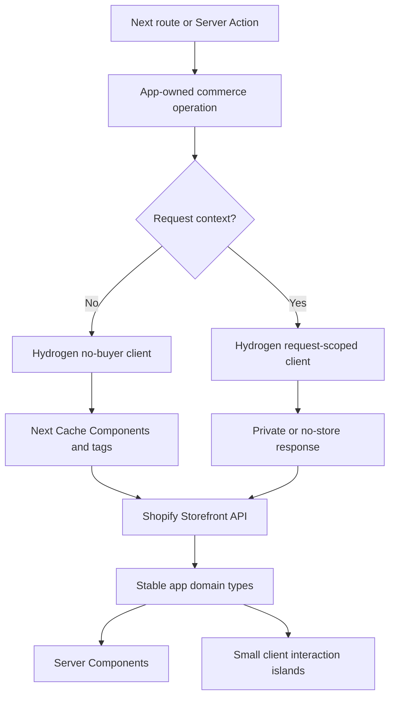
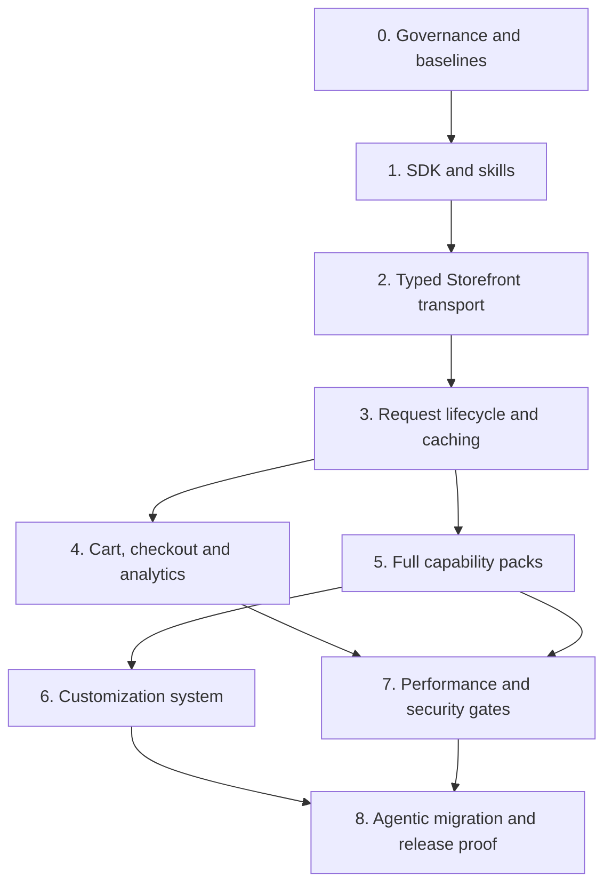
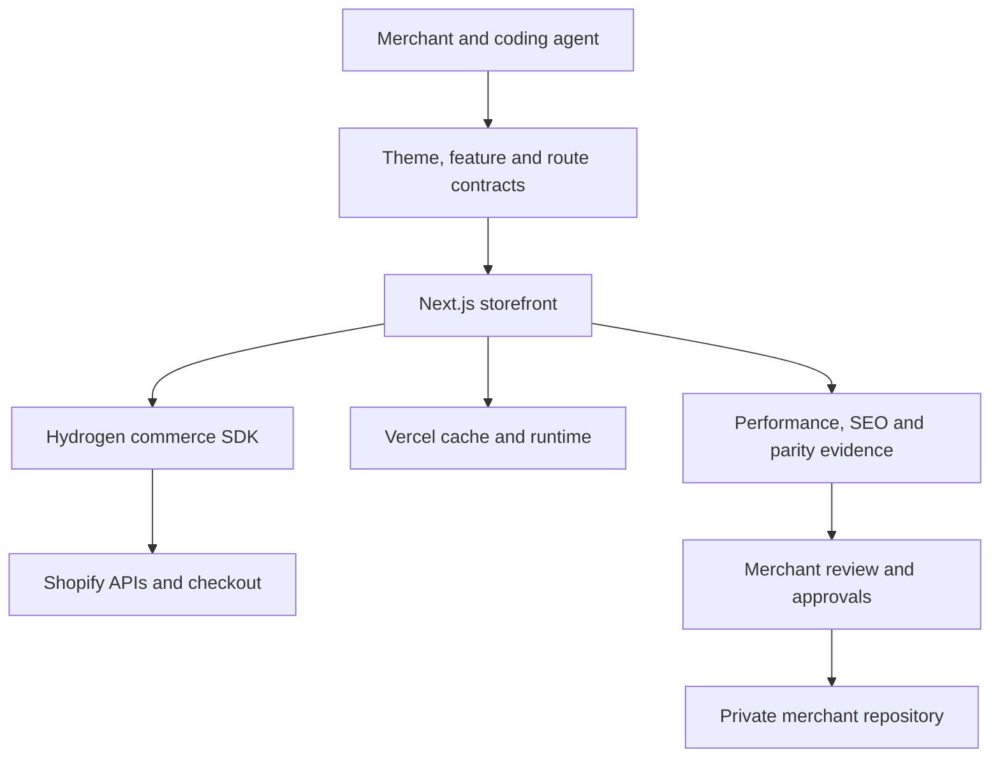

# feat: Adopt Hydrogen and complete the storefront platform

## Overview

Evolve the existing Next.js storefront into a production-grade, full-featured and deeply customizable
Shopify foundation by adopting Shopify's new framework-agnostic Hydrogen SDK behind the application's
existing commerce boundaries. Next.js remains the application framework, Vercel remains the first
supported host, Shopify remains the commerce system of record, and Hydrogen becomes the Shopify-owned
substrate for the behavior Shopify is uniquely positioned to maintain correctly.

This is a companion execution plan to
`docs/plans/2026-07-13-001-feat-autonomous-shopify-starter-plan.md`. The existing plan remains the source
of truth for clean-room migration, discovery, evidence, approvals and release proof. This plan owns the
storefront runtime, Hydrogen adoption, feature coverage, customization architecture, performance budgets
and the contracts the migration agent targets. Its Hydrogen decisions supersede the parent plan's earlier
preview exclusion once ADR 0002 is accepted; Unit 0 updates the parent plan so the two documents cannot
remain contradictory.

The adoption is intentionally incremental. The current direct Storefront transport, operation layer and
cart are characterized first. Hydrogen then replaces one behavior group at a time. Temporary comparison
coverage proves equivalence; it does not become a permanent dual-provider architecture. Once a slice is
accepted, its obsolete implementation and compatibility code are removed.

## Problem Frame

The current repository already contains a credible Next.js 16 commerce runtime: 29 application route
files, approximately 100 components, 44 library modules, typed Storefront operations, Cache Components,
cart state and Shopify-hosted checkout. It is not yet an exceptional public starter:

- only three automated tests exist and there is no browser, accessibility, visual, Lighthouse or bundle
  regression harness;
- the app owns Shopify-specific transport, cart transformation, route handling and analytics plumbing
  that the new Hydrogen toolkit is intended to standardize;
- GraphQL uses generated schema/types rather than Hydrogen's packaged schema and `gql.tada` validation;
- blogs/articles, robust Markets support, first-party consent-aware analytics, headless customer accounts,
  selling plans and several conditional integration recipes are incomplete or absent;
- customization has semantic CSS tokens and source-owned primitives, but no versioned section registry,
  capability manifest or explicit foundation-versus-merchant ownership contract;
- performance intent exists, but executable route budgets and field telemetry contracts do not.

Shopify's July 2026 Hydrogen preview is unusually aligned with the product: it is a framework-agnostic SDK
plus agent skills, supports Next.js and Vercel, and supplies typed Storefront access, carts, routing,
Markets, money, Shop Pay, analytics, predictive search and customer-account primitives. It is also still
a preview with an API that can change. The project must capture its value without turning merchants into
involuntary beta testers.

## Requirements Trace

| Platform requirement                                                        | Origin coverage       | Plan response                                                                                     |
| --------------------------------------------------------------------------- | --------------------- | ------------------------------------------------------------------------------------------------- |
| H1. Keep Next.js and Vercel as first-class choices                          | R14-R23, R37          | Hydrogen is an SDK dependency, not a framework or hosting migration.                              |
| H2. Use Shopify-owned commerce behavior where it improves correctness       | R14-R17, R25, R37     | Adopt Hydrogen transport, cart, routing, money, Markets and analytics incrementally.              |
| H3. Preserve shopper behavior throughout migration                          | R1-R3, R24-R28        | Characterization and browser contracts gate every cutover.                                        |
| H4. Provide a complete invariant commerce core                              | R14-R16, R25          | Products, variants, collections, search, cart, pages, policies, redirects, accounts and checkout. |
| H5. Make advanced capabilities ready to enable without bloating every store | R17, R47              | Capability manifest and conditional feature packs with explicit dependencies.                     |
| H6. Make brand and layout deeply customizable                               | R18-R19               | Three-layer tokens, component variants, section registry and merchant-owned recipes.              |
| H7. Be measurably fast, not merely described as fast                        | R24, R48, R53         | Field CWV contract plus lab, bundle, query, image and third-party budgets.                        |
| H8. Preserve SEO, accessibility and progressive enhancement                 | R1, R3, R24-R27, R48  | Route/status/metadata tests, WCAG 2.2 AA, no-JS cart and resilient forms.                         |
| H9. Remain safe under hostile content and preview dependencies              | R31-R35, R48-R51      | Pinned provenance, secret boundaries, cache isolation, CSP and generated-code quarantine.         |
| H10. Be genuinely operable by coding agents                                 | R20-R23, R38-R46, R52 | Pinned Hydrogen skills, capability map, shared state, explicit completion and conformance tests.  |
| H11. Remain clean-room and updateable                                       | R34-R37, R54-R55      | No merchant material in foundation; versioned downstream ownership and migrations.                |

## Scope Boundaries

- Do not migrate the application to the current React Router-based Hydrogen framework.
- Do not move hosting to Oxygen. Oxygen can be documented as an alternative after a separate portability
  proof; Vercel is the supported first host.
- Do not replace Shopify-hosted checkout or build a custom checkout baseline.
- Do not promise generic replacement for every Shopify app. Unknown or revenue-critical integrations
  remain explicit blockers or downstream adapters.
- Do not ship two permanent Storefront clients, two cart stores, Base UI and Radix variants, or multiple
  styling systems.
- Do not enable browser-agent/WebMCP exposure by default until its data, consent, abuse and performance
  boundaries pass dedicated review.
- Do not cache cart, customer-account or other personalized data in a shared cache.
- Do not make live Shopify Admin writes, deploy, activate tracking, attach domains or change DNS without
  separately authenticated human approval.
- Do not add merchant source, assets, credentials, snapshots, reports or generated merchant code to this
  foundation repository.

### Deferred to Separate Tasks

- Multi-tenant hosted onboarding and credential brokering
- Non-Vercel production qualification
- Custom checkout, B2B/wholesale and Shopify POS experiences
- A shopper-facing conversational assistant
- Generic loyalty, wishlist or personalization backends without a proving-store requirement

## Context & Research

### Relevant Code and Patterns

- `lib/shopify/storefront.ts` owns the current authenticated GraphQL transport, API-version drift check,
  redacted errors and Storefront MCP access.
- `lib/shopify/operations/**` provides the right app-owned seam: routes/components call operations rather
  than transport directly. Preserve that seam while replacing implementations.
- `lib/shopify/fetch.ts`, `lib/shopify/fragments.ts` and `lib/shopify/transforms/**` contain the current
  Storefront documents and domain mapping.
- `lib/cart/**` and `components/cart/**` implement request-bound cart cookies, Server Actions, optimistic
  state, warnings and checkout handoff.
- `lib/shopify/operations/products.ts` and related operation modules already distinguish shared catalogue
  caching from cart state with `use cache`, `use cache: remote`, tags and webhook revalidation.
- `shop.config.ts` is the current customization entry point and should become the root of a validated,
  capability-aware store configuration rather than being bypassed by generated code.
- `app/**` already covers home, products, collections, search, cart, pages, policies, sitemap, robots,
  markdown representations and error states.
- `tests/unit/shopify/storefront.test.ts` is the first transport characterization suite; it is too narrow
  to authorize a transport or cart cutover by itself.

### Institutional Learnings

No `docs/solutions/` knowledge base exists yet. Applicable learnings are carried from the active
autonomous-starter plan:

- magic collection or menu handles make new stores silently empty;
- cursor pagination is required from the beginning;
- missing, expired and completed cart IDs must recover without losing visible intent;
- Shopify warnings and `userErrors` must reach the shopper, and failed mutations must not emit success
  analytics;
- parity includes statuses, redirects, canonicals, query state, account/checkout handoffs and redirect
  cycle handling;
- purchase attribution and checkout analytics cross a Shopify-owned domain boundary.

### External References

- [Hydrogen developer preview](https://shopify.dev/docs/storefronts/headless/developer-preview)
- [Hydrogen developer preview architecture](https://hydrogen.shopify.dev/update/hydrogen-developer-preview)
- [July 2026 Hydrogen preview update](https://shopify.dev/changelog/hydrogen-developer-preview-update)
- [Storefront API foundations](https://shopify.dev/docs/storefronts/headless/building-with-the-storefront-api)
- [Shopify performant data loading](https://shopify.dev/docs/storefronts/headless/hydrogen/performance/data-loading)
- [Next.js production guidance](https://nextjs.org/docs/app/guides/production-checklist)
- [Core Web Vitals thresholds](https://web.dev/articles/vitals)

### Audited Preview Input

The planning baseline is the package resolved by the `preview` tag on 2026-07-16:

| Field                 | Value                                                                                             |
| --------------------- | ------------------------------------------------------------------------------------------------- |
| Package               | `@shopify/hydrogen`                                                                               |
| Exact version         | `0.0.0-preview-8a708a8-20260708155454`                                                            |
| Package commit marker | `8a708a8`                                                                                         |
| SHA-1                 | `8f40a1bef510b6be13c507da2e7a43e6ae3e6e14`                                                        |
| Integrity             | `sha512-JNd3ZRaMvSZLKDBsPqMa1a0zsCBuLtaoedkzyUOyvXq6eTqSAVhClxpig+I6O9EFrY1cRKh9S43AeTqDBJ9fqQ==` |
| Runtime dependency    | `gql.tada`                                                                                        |
| React peer range      | React 18 or 19                                                                                    |

Never install the moving `preview` tag in CI or a release. The exact package version and lockfile are the
only acceptable preview inputs.

## Key Technical Decisions

| Decision              | Resolution                                                                                                        | Rationale                                                                                                  |
| --------------------- | ----------------------------------------------------------------------------------------------------------------- | ---------------------------------------------------------------------------------------------------------- |
| Application framework | Keep Next.js 16 App Router                                                                                        | Preserves Cache Components, RSC, Vercel integration and existing investment.                               |
| Shopify substrate     | Adopt framework-agnostic Hydrogen incrementally                                                                   | Shopify should own correctness-sensitive commerce primitives while the app owns experience and migration.  |
| Preview policy        | Dated, exact-version exception behind an ADR and acceptance gates                                                 | The SDK is strategically valuable but not yet stable enough for an unqualified dependency.                 |
| Review/expiry         | Review every 30 days; replace with first acceptable stable release or expire the exception by 2026-10-31          | Prevents a forgotten preview dependency from becoming permanent.                                           |
| Application boundary  | Preserve `lib/shopify/operations/**` and domain types                                                             | Avoids coupling pages and components directly to preview APIs and keeps downstream customizations stable.  |
| Cutover method        | Characterize, replace one slice, compare, remove old slice                                                        | Avoids a permanent provider abstraction and prevents two carts or transports shipping together.            |
| GraphQL typing        | Move from generated schema output to Hydrogen `gql()` plus `gql.tada check`                                       | Uses Shopify's packaged schema and makes invalid documents fail in CI without credentialed codegen.        |
| Client types          | No-buyer-context private client for cached/prerendered data; request-scoped private client for buyer-context work | Preserves attribution while keeping request data out of shared caches.                                     |
| Buyer IP              | Resolve only from trusted Vercel forwarding headers at the server boundary                                        | Never trust arbitrary client-supplied forwarding headers.                                                  |
| Cache ownership       | Next Cache Components and tags own app catalogue caching; Hydrogen request context owns transport headers/timing  | Prevents nested caches with conflicting freshness and invalidation.                                        |
| Personalized caching  | Cart/account/session responses are `private` or `no-store`                                                        | Prevents cross-shopper leakage.                                                                            |
| Routing               | One route-template manifest shared by redirects, Shopify scripts and search URLs                                  | Preserves custom routes and prevents separately hard-coded URL rules.                                      |
| Environment names     | Adopt Hydrogen's canonical names with a time-bounded server-only alias layer for existing names                   | Aligns docs/skills without breaking local evaluation immediately.                                          |
| Feature model         | Small invariant core plus install-ready conditional packs                                                         | “Full featured” means complete capability, not shipping unused JavaScript and integrations to every buyer. |
| Customization         | Semantic tokens → component variants → section recipes                                                            | Gives agents safe high-level controls while retaining source-level escape hatches.                         |
| UI primitives         | shadcn source-owned components on Base UI only                                                                    | Full source ownership without a second primitive dependency.                                               |
| Analytics             | Hydrogen/Shopify standard events behind an explicit consent adapter                                               | Avoids duplicate or non-compliant events while keeping provider-neutral destinations possible.             |
| WebMCP                | Capability-gated and disabled until tested                                                                        | Agent discoverability is useful, but browser exposure is a distinct trust surface.                         |
| Accounts              | Hosted account handoff remains default; headless Customer Account API is an optional pack                         | Safe default with a richer path for stores that need account UI parity.                                    |
| Deployment            | Vercel first; no Oxygen dependency                                                                                | Hydrogen preview is runtime agnostic and Vercel is already the tested platform.                            |

The environment alias is deliberately narrow: `SHOPIFY_STORE_DOMAIN` may resolve to
`PUBLIC_STORE_DOMAIN`, and the existing Storefront token may resolve only to
`PUBLIC_STOREFRONT_API_TOKEN`. A public token must never be relabeled or silently used as
`PRIVATE_STOREFRONT_API_TOKEN`. Buyer-context private clients require a real Headless-channel private
token; flows that do not have one must use an explicitly public/no-buyer path rather than weakening the
type or trust boundary.

## Adoption Gates and Rollback

| Gate           | Entry condition                         | Exit evidence                                                             | Rollback boundary                                         |
| -------------- | --------------------------------------- | ------------------------------------------------------------------------- | --------------------------------------------------------- |
| G0 — Audit     | Current runtime is green                | Exact package/license/skills and baseline behavior recorded               | Remove docs-only exception; runtime unchanged             |
| G1 — Transport | SDK installed but unused by routes      | Query/error/locale/version contracts pass on one operation group          | Restore previous operation implementation                 |
| G2 — Catalogue | All read operations use Hydrogen client | Typed-query, cache-tag, pagination and production route tests pass        | Revert operation group; no cart impact                    |
| G3 — Lifecycle | Catalogue stable                        | Handler/header/redirect/market/cache isolation and overhead budgets pass  | Remove proxy/handlers; catalogue client remains usable    |
| G4 — Cart      | Request lifecycle stable                | No-JS, optimistic, concurrent, recovery, consent and checkout suites pass | Revert cart slice as one unit; catalogue remains migrated |
| G5 — Platform  | One cart and one transport remain       | Feature, customization, performance, security and upgrade matrices pass   | Restore last accepted foundation release                  |

No gate is passed by compilation alone. A rollback must not require converting merchant data because the
Storefront foundation does not own Shopify catalogue, customer, order or checkout persistence.

## Runtime Modes

| Mode               | Included by default                                                      | Loaded only when enabled                        | Shared-cache policy                        |
| ------------------ | ------------------------------------------------------------------------ | ----------------------------------------------- | ------------------------------------------ |
| Invariant commerce | catalogue, collections, product, search, cart, pages, policies, checkout | N/A                                             | Shared catalogue; never cart               |
| International      | base locale/country contract                                             | Markets selector, localized paths, translations | Shared per bounded market/locale           |
| Content            | standard pages/policies                                                  | blogs, articles, metaobject landing pages       | Shared and tagged                          |
| Account            | hosted account link                                                      | headless login/profile/orders                   | Private/no-store                           |
| Merchandising      | recommendations, bundles surfaced by Shopify                             | reviews, subscriptions, third-party search      | Provider-specific and independently cached |
| Agent/browser      | coding-agent repository skills                                           | WebMCP/browser agent surface                    | No private state exposure                  |

## Open Questions

### Resolved During Planning

- **Should the project move to React Router Hydrogen?** No. The new SDK complements Next.js.
- **Should it move to Oxygen?** No. Hosting is orthogonal and Vercel remains first-class.
- **Should Hydrogen replace the whole application in one change?** No. Characterized slices reduce risk.
- **Should every possible storefront feature be enabled globally?** No. The complete library is present,
  while feature packs load code and credentials only when configured and discovered.
- **Who owns caching?** Next owns app data/render caching; Hydrogen supplies request context, transport
  correctness and response headers. Personalized data is never shared.
- **Can preview code enter the baseline?** Yes only under the exact, dated and removal-bound exception in
  this plan and its ADR.
- **Must the first experimental alpha wait for a stable Hydrogen release?** No artificial date gate is
  imposed. An exact preview may be used only if G5 passes, the exception is actively renewed and the
  public compatibility statement identifies the preview dependency and upgrade policy. Stable is
  preferred and replaces the preview as soon as its conformance suite passes.

### Deferred to Implementation

- Final absolute compressed-JavaScript ceilings are set after the neutral fixture records route-level
  baselines; until then, any route increase above 5 KiB requires an explicit budget update and rationale.
- The Hydrogen request-handler cost on ordinary Next routes must be measured in production mode before
  the proxy is accepted.
- The exact split between existing Next cache directives and Hydrogen's new catalogue cache API depends
  on observed response headers and invalidation behavior in the pinned preview.
- Customer Account API cookie/session storage is selected only when that optional pack is implemented;
  hosted accounts remain unaffected.
- WebMCP remains disabled until its generated tool surface, consent, abuse controls and bundle/runtime
  cost are inspected against a neutral store.
- Whether Shopify runtime scripts can remain present on every route without harming cacheability, CSP or
  client budgets depends on production-mode measurement. Until accepted, load only the minimum required
  script surface and keep a configuration kill switch.

## Output Structure

```text
lib/
  commerce/                    app-owned capability and feature contracts
  shopify/
    hydrogen/                  pinned SDK adapters and request context
    operations/               stable app-owned operations
    routing/                   one route-template manifest
  analytics/                  consent and event contracts
  performance/                route budgets and measurement metadata
components/
  commerce/                    invariant buyer-facing composition
  sections/                    reusable, registry-backed sections
  integrations/               feature-pack UI adapters
config/
  schema/                      validated shop, feature and theme contracts
  presets/                     neutral layout/design presets
tests/
  contracts/                   legacy-to-Hydrogen characterization
  integration/                cross-layer commerce behavior
  browser/                    buyer journeys, a11y, visual and SEO
  performance/                Lighthouse, bundles and request budgets
docs/
  adr/                         preview and cache decisions
  compatibility/              capability and integration matrix
  runbooks/                    setup, upgrades and failure handling
```

## High-Level Technical Design

> _This illustrates the intended approach and is directional guidance for review, not implementation
> specification. The implementing agent should treat it as context, not code to reproduce._



The app-owned operation layer is the stable contract for pages, components and migration output.
Hydrogen is allowed to change beneath that boundary. Merchant repositories own composition and assets;
the foundation owns commerce correctness, component contracts and verification.

## Implementation Units



- [ ] **Unit 0: Freeze governance, contracts and measurable baselines**

**Goal:** Authorize a bounded preview experiment and record the current runtime behavior, coverage and
performance before dependencies or shopper behavior change.

**Requirements:** H1-H3, H7-H11; R22, R24-R26, R31-R37, R48

**Dependencies:** None

**Files:**

- Create: `docs/adr/0002-hydrogen-preview-adoption.md`
- Create: `docs/compatibility/storefront-capabilities.md`
- Create: `docs/performance/budgets.md`
- Create: `tests/contracts/storefront-transport.test.ts`
- Create: `tests/contracts/cart-behavior.test.ts`
- Create: `tests/contracts/route-behavior.test.ts`
- Modify: `docs/TASKS.md`, `README.md`, `package.json`
- Modify: `docs/plans/2026-07-13-001-feat-autonomous-shopify-starter-plan.md`

**Approach:**

- Record exact package version/integrity, owner, review cadence, expiry, stabilization/removal condition
  and rollback path in the ADR.
- Inventory every currently supported route, operation, cart mutation, cache tag, environment variable,
  error shape and feature flag.
- Expand deterministic transport and cart fixtures before changing implementations.
- Establish the neutral performance fixture and record production-mode route/client bundle, request,
  rendering and accessibility baselines.
- Define budgets as versioned repository data so CI and agents use the same thresholds.
- Reconcile ADR 0001 and the parent plan through ADR 0002's narrow supersession; all other stable-platform
  decisions remain unchanged.
- Compare each intended migration slice with the current official Hydrogen Next.js example and pinned
  Vercel Shop upstream before building a parallel solution that upstream already supplies.

**Execution note:** Characterization-first. Tests describe current approved behavior, not implementation
details that Hydrogen is expected to replace.

**Patterns to follow:**

- `tests/unit/shopify/storefront.test.ts`
- `docs/adr/0001-platform-baseline.md`
- `docs/security/trust-boundaries.md`

**Test scenarios:**

- Happy path: public catalogue request carries locale and returns stable domain data.
- Error path: HTTP, GraphQL, API-version and malformed-response failures remain redacted and actionable.
- Cart: create/add/update/remove/discount/note/checkout behavior is captured for empty and populated carts.
- Recovery: missing, completed and expired cart IDs have explicit expected outcomes.
- Routes: products, collections, pages, policies, search, cart and unknown paths preserve statuses and
  canonical behavior.
- Performance: baseline report is reproducible in production mode and fails if required routes are absent.

**Verification:**

- A reviewer can compare pre- and post-Hydrogen behavior without reading either implementation.

- [x] **Unit 1: Pin Hydrogen and install its agent guidance with provenance**

**Goal:** Add the exact SDK and matching Shopify-maintained skills without accepting a moving preview tag
or weakening clean-room/supply-chain guarantees.

**Requirements:** H2, H9-H11; R20-R23, R31, R34, R37

**Dependencies:** Unit 0

**Files:**

- Modify: `package.json`, `pnpm-lock.yaml`, `agent-workflows/skills.json`
- Create: `.agents/skills/hydrogen-*/**`
- Create: `docs/provenance/hydrogen-sdk.json`
- Create: `scripts/agents/sync-hydrogen-skills.mjs`
- Modify: `scripts/agents/verify-skills.mjs`
- Test: `tests/clean-room/hydrogen-provenance.test.ts`
- Test: `tests/unit/config-contract.test.ts`

**Approach:**

- Install only the exact audited preview version and record tarball integrity, license, exported surfaces
  and copied skill checksums.
- Copy skills from the installed package rather than a mutable URL; fail on local drift or unexpected
  skill additions/removals.
- Amend the stable-channel contract test to allow only the exact, ADR-bound Hydrogen exception.
- Audit dependency scripts and ensure the SDK cannot add an unreviewed install lifecycle.
- Keep `.agents/skills` canonical and mirror it to supported agent hosts through existing adapters.

**Test scenarios:**

- Happy path: exact package and skill checksums verify on a frozen-lockfile install.
- Error path: moving tag, version drift, tarball mismatch or modified skill fails checks.
- Supply chain: unexpected lifecycle script, package export or transitive dependency requires review.
- Portability: Codex and Claude discover the same Hydrogen skill versions.

**Verification:**

- The repository can prove exactly which Shopify code and instructions it adopted.

- [ ] **Unit 2: Replace the Storefront transport and GraphQL typing in slices**

**Goal:** Use Hydrogen's request context, Storefront client and packaged GraphQL schema while preserving
stable operation/domain contracts and Next's server-first architecture.

**Requirements:** H2-H4, H7, H9; R14-R16, R25, R34, R37, R48

**Dependencies:** Unit 1

**Files:**

- Create: `lib/shopify/hydrogen/env.ts`
- Create: `lib/shopify/hydrogen/request-context.ts`
- Create: `lib/shopify/hydrogen/storefront.ts`
- Modify: `lib/shopify/operations/**`, `lib/shopify/fetch.ts`, `lib/shopify/fragments.ts`
- Modify: `tsconfig.json`, `package.json`, `.env.example`, `next.config.ts`
- Remove when complete: `.graphqlrc.ts`, generated Storefront schema/type outputs, obsolete codegen packages
- Test: `tests/unit/shopify/hydrogen-storefront.test.ts`
- Test: `tests/contracts/storefront-transport.test.ts`

**Approach:**

- Validate canonical Hydrogen environment variables in a server-only module; temporarily accept old
  variable names with a deprecation warning that never prints values.
- Create separate no-buyer-context and request-scoped client factories. Never capture request state in a
  module singleton.
- Resolve and validate environment only inside server-only factories. Importing route/proxy modules for
  type generation or secretless tests must not eagerly require or serialize credentials.
- Do not configure Hydrogen's optional response cache for operation paths already wrapped by Next Cache
  Components. Introduce it only after an explicit cache-ownership ADR and invalidation proof.
- Preserve trusted buyer-IP resolution, locale/country, API-version assertions, request IDs, redaction,
  Storefront annotations and observable timing.
- Migrate GraphQL documents in dependency order: shop/config → menus/pages/policies → products/collections
  → search/sitemap → cart.
- Add the `gql.tada` TypeScript plugin and a dedicated query-validation check; remove credentialed codegen
  only after every operation is migrated.
- Remove the legacy transport after contract parity, rather than retaining a runtime provider switch.

**Test scenarios:**

- Happy path: typed query returns the same stable operation/domain result as the characterized transport.
- Locale: bounded country/language inputs reach Shopify and produce market-correct values.
- Security: private token and buyer IP never cross into client bundles, serialized RSC props or errors.
- Error path: GraphQL errors, throttling metadata, network failures, invalid JSON and API fall-forward are
  classified without response-body leakage.
- Build: an invalid Storefront field fails `gql.tada check` without Shopify credentials.
- Concurrency: simultaneous requests cannot share buyer context or headers.

**Verification:**

- No application route/component imports Hydrogen's Storefront transport directly; the app-owned
  operation boundary remains intact, all Storefront documents validate in CI and obsolete codegen is
  removed. Later React bindings remain isolated to explicit commerce adapter components.

- [ ] **Unit 3: Integrate Hydrogen routing, request lifecycle, Markets and cache boundaries**

**Goal:** Add Shopify-owned request handlers and routing without turning ordinary Next routes dynamic,
slowing every request or compromising cache correctness.

**Requirements:** H1-H4, H7-H9; R1, R14-R16, R24-R26, R37, R48

**Dependencies:** Unit 2

**Files:**

- Create: `lib/shopify/routing/templates.ts`
- Create: `proxy.ts`
- Modify: `app/not-found.tsx`, `app/layout.tsx`, `app/robots.ts`
- Modify: `lib/shopify/operations/**`, `app/api/webhooks/shopify/route.ts`
- Create: `lib/commerce/market.ts`, `components/commerce/market-selector.tsx`
- Test: `tests/integration/hydrogen-request-lifecycle.test.ts`
- Test: `tests/integration/cache-isolation.test.ts`
- Test: `tests/browser/routing-and-markets.spec.ts`

**Approach:**

- Create one serializable route-template manifest representing the app's actual Shopify resource paths.
- Wire `handleShopifyRoutes` before application routing and `handleShopifyRedirects` only after a real 404.
- Preserve original URL, response cookies, Server-Timing and cache-safety headers across Next boundaries.
- Measure proxy overhead and Shopify network activity on ordinary cached routes; reject wiring that causes
  catalogue calls on non-Hydrogen paths.
- Keep static shell/catalogue data in Next Cache Components with low-cardinality locale/market cache keys
  and webhook tags. Use no-store/private responses for request-bound data.
- Add market/locale path, cookie and URL rules without baking prefixes into resource templates.
- Detect redirect chains/cycles and preserve permanent status where required.
- Inventory every Shopify-hosted runtime script, event listener and outbound origin. Keep WebMCP off and
  pass only the route/market/shop values required by an enabled capability.
- Deny production GraphiQL and keep `/api/mcp`, `/agent/*` and other agent-facing handlers unavailable
  unless the corresponding capability is explicitly enabled and independently rate/body/origin bounded.

**Test scenarios:**

- Handler: Hydrogen-owned cart/GraphQL/search endpoints bypass Next pages and preserve required headers.
- Exposure: GraphiQL is development-only; MCP/agent routes return 404 when disabled; Storefront/cart
  proxies enforce expected methods, body limits and same-origin/CORS policy.
- Ordinary route: cached product/home requests make no extra proxy Storefront call and retain static shell.
- Cacheability: anonymous catalogue responses do not gain unnecessary `Set-Cookie`, visit/session state
  or personalized markers merely because request context exists.
- Redirect: Shopify URL redirect runs only after 404; `/admin` redirects safely; redirect loops fail closed.
- Cache: product/collection/page/menu webhook invalidates only related tags.
- Privacy: cart/account responses cannot receive public/CDN cache headers.
- Markets: locale/country changes preserve route and variant/query state and display contextual currency.
- Error path: Shopify unavailable yields explicit degraded behavior rather than caching an error page as
  valid content.

**Verification:**

- Request lifecycle passes in development and production builds with measured overhead inside budget.

- [ ] **Unit 4: Move cart, money, checkout, Shop Pay and analytics to Hydrogen contracts**

**Goal:** Deliver a progressively enhanced, conversion-safe cart and checkout path backed by Shopify's
official reactive primitives and consent-aware event model.

**Requirements:** H2-H5, H7-H9; R14-R16, R24-R26, R29, R47-R48

**Dependencies:** Unit 3

**Files:**

- Modify: `lib/cart/**`, `components/cart/**`, `components/cart-page/**`
- Modify: `components/product-detail/**`, `app/cart/page.tsx`, `app/layout.tsx`
- Create: `lib/analytics/consent.ts`, `lib/analytics/events.ts`
- Create: `components/analytics/shopify-analytics.tsx`
- Test: `tests/integration/cart.test.ts`
- Test: `tests/browser/cart-and-checkout.spec.ts`
- Test: `tests/browser/analytics-consent.spec.ts`

**Approach:**

- Characterize current optimistic batching, warnings, bfcache recovery, cookies and checkout preparation.
- Install Hydrogen cart server handlers, server-rendered initial state and selector-based React bindings.
- Retain a functional `/cart` route and progressive line-item forms when JavaScript is unavailable.
- Support quantity, lines, notes, discount codes, gift cards, buyer identity, delivery addresses/options
  exposed by the supported Storefront contract, with visible Shopify warnings and user errors.
- Use Shopify money primitives for currency-correct display; never perform floating-point pricing math.
- Use cart-provided checkout URLs and Shop Pay primitives; do not synthesize a custom checkout.
- Emit standard Shopify events only after consent and successful actions. Keep a provider-neutral fan-out
  contract for optional analytics destinations, and never claim purchase completion on this domain.
- Remove the existing cart context/actions only after equivalent browser and no-JS journeys pass.

**Test scenarios:**

- Cart lifecycle: empty/create/add/update/remove/clear persists across refresh and back navigation.
- Recovery: missing, expired, completed or foreign cart IDs recover without cross-shopper data.
- Concurrency: rapid add/update/remove operations settle to Shopify truth without lost updates.
- Commerce: discounts, gift cards, selling-plan lines, bundles and delivery warnings render correctly.
- No-JS: product add and cart line updates remain usable through progressive forms.
- Checkout: hosted checkout and Shop Pay use returned URLs and preserve attribution.
- Analytics: denied/unknown consent emits nothing; granted consent emits one successful event; failed cart
  mutations emit no success event.
- Accessibility: drawer focus, dismissal, announcements and keyboard/touch behavior meet WCAG 2.2 AA.

**Verification:**

- One cart implementation remains, the buyer journey passes with and without JavaScript, and analytics
  events are consent-correct and non-duplicated.

- [ ] **Unit 5: Complete invariant commerce and install-ready feature packs**

**Goal:** Make the starter useful for serious stores out of the box while loading optional code and
credentials only when the merchant actually needs them.

**Requirements:** H4-H6, H8-H11; R14-R19, R24-R28, R47-R48

**Dependencies:** Unit 3; cart-dependent scenarios also depend on Unit 4

**Files:**

- Create: `lib/commerce/capabilities.ts`, `config/schema/features.ts`
- Modify: `shop.config.ts`, `lib/shopify/operations/**`, `app/**`
- Create: `app/blogs/[handle]/page.tsx`, `app/blogs/[handle]/[article]/page.tsx`
- Create: `components/integrations/**`, `lib/integrations/**`
- Create: `docs/compatibility/feature-packs.md`
- Test: `tests/unit/commerce/capabilities.test.ts`
- Test: `tests/integration/storefront-capabilities.test.ts`
- Test: `tests/browser/storefront-core.spec.ts`
- Test: `tests/browser/feature-packs.spec.ts`

**Approach:**

- Finish the invariant core: products, encoded variants, selling plans, bundles, collections, filters,
  sort, pagination, predictive/full search, menus, pages, policies, redirects, cart, recommendations,
  hosted accounts, hosted checkout, Markets, metadata and structured data.
- Add source-triggered packs for blogs/articles, metaobject landing pages, headless customer accounts,
  newsletter/forms, reviews, subscriptions, third-party search and consent/analytics providers.
- Give each pack a capability ID, configuration schema, required environment names, route/component
  consumers, cache/data classification, agent instructions, verification scenarios and unsupported cases.
- Use dynamic imports and server-only modules so a disabled pack adds no browser JavaScript and cannot
  read its credentials.
- Keep provider interfaces narrow and outcome-based. Do not hide unsupported app behavior behind a fake
  generic implementation.
- Render complete loading, empty, unavailable, partial and failure states for every core surface.

**Test scenarios:**

- Catalogue: null media, single/many options, unavailable variants, high variant count and selling plans.
- Collections/search: empty and cursor-paginated large catalogues preserve filters/sort/tracking params.
- Content: pages, policies, blogs/articles and rich HTML produce correct status, sanitization and metadata.
- Markets: localized pricing, availability, translated handles and unsupported market fallbacks.
- Accounts: hosted mode has no session code; headless mode prevents private caching and refresh loops.
- Feature isolation: disabled pack contributes no route, client chunk, environment read or analytics event.
- Integration failure: provider timeout streams a bounded fallback without blocking the primary buy path.
- SEO: canonical, hreflang, Product, BreadcrumbList, Article and Organization data match visible content.

**Verification:**

- Capability matrix is executable and every declared supported capability has a route/component consumer
  and cross-layer test.

- [ ] **Unit 6: Build the customization and section-composition system**

**Goal:** Let agents reproduce approved merchant designs faithfully and later evolve them without
forking commerce logic or scattering untraceable style overrides.

**Requirements:** H5-H6, H8, H10-H11; R1-R3, R17-R23, R36, R43

**Dependencies:** Unit 5

**Files:**

- Create: `config/schema/shop.ts`, `config/schema/theme.ts`, `config/schema/sections.ts`
- Create: `config/presets/**`, `components/sections/**`, `components/sections/registry.ts`
- Modify: `app/globals.css`, `components/ui/**`, `shop.config.ts`
- Create: `docs/customization/design-tokens.md`, `docs/customization/sections.md`
- Create: `agent-workflows/capability-map.json`
- Test: `tests/unit/config/theme-contract.test.ts`
- Test: `tests/unit/sections/registry.test.ts`
- Test: `tests/browser/section-gallery.spec.ts`
- Test: `tests/browser/theme-presets.spec.ts`

**Approach:**

- Formalize three layers: observed evidence, semantic merchant tokens and component/section variants.
- Cover typography, contrast pairs, spacing/density, containers/grids, breakpoints, radii, borders,
  shadows, focus, motion, imagery and responsive precedence through semantic variables.
- Define registry metadata for section anatomy, slots, data needs, variants, responsive behavior,
  accessibility, composition constraints, performance cost and visual stories.
- Supply a neutral starter set: announcement, header, hero, rich text, media/text, logo list, collection
  grid, product carousel, editorial grid, testimonials, FAQ, newsletter, trust strip and footer.
- Keep layouts as merchant-owned recipes assembled from registered sections. Agents may add a downstream
  one-off section without changing the foundation registry; only repeated patterns are promoted.
- Validate configuration with useful errors and deterministic fallbacks. Preserve source-level escape
  hatches because shadcn components remain owned by the project.
- Map every merchant-visible customization outcome to files/commands the coding agent can operate.

**Test scenarios:**

- Config: valid token/section recipes resolve deterministically; unknown IDs and invalid contrast pairs
  fail with actionable paths.
- Responsive: section variants preserve intended order, media crop and typography across bounded widths.
- Accessibility: each interactive section passes focus, reduced-motion, contrast and semantic checks.
- Performance: disabled sections add no code; below-fold heavy sections stream/lazy-load within budget.
- Ownership: foundation update preserves merchant recipe/assets and reports conflicts rather than
  overwriting them.
- Agent parity: every documented UI customization can be achieved through the shared repository and
  validated without a private UI-only action.

**Verification:**

- A neutral fixture can be transformed into materially different storefronts through tokens, variants
  and recipes without modifying invariant commerce operations.

- [ ] **Unit 7: Enforce performance, accessibility, security and operational excellence**

**Goal:** Turn best-practice claims into release-blocking measurements for every critical storefront
route and state.

**Requirements:** H3-H4, H7-H9, H11; R3, R24-R30, R31-R37, R48

**Dependencies:** Units 4-6 for their relevant surfaces

**Files:**

- Create: `playwright.config.ts`, `lighthouserc.*`
- Create: `tests/browser/**`, `tests/performance/**`, `tests/visual/**`
- Create: `scripts/performance/bundle-budget.mjs`, `scripts/performance/query-budget.mjs`
- Create: `lib/security/**`, `lib/observability/**`
- Modify: `next.config.ts`, `.github/workflows/ci.yml`, `package.json`
- Create: `docs/runbooks/performance.md`, `docs/runbooks/degraded-shopify.md`

**Approach:**

- Gate the neutral core at field CWV targets: p75 LCP at or below 2.5 seconds, INP at or below 200 ms and
  CLS at or below 0.1, segmented by mobile and desktop when field data exists.
- Require production-mode lab coverage on home, collection, PDP, search and cart. Target Lighthouse 95+
  performance and 100 accessibility/best-practices/SEO for the neutral fixture; exceptions need recorded
  evidence and an expiry.
- Record per-route compressed client JavaScript, CSS, image, font, request count, third-party execution,
  TTFB and GraphQL cost. Block regressions over the versioned budget.
- Enforce Server Components by default, leaf client islands, parallel critical data, Suspense for
  non-critical content, direct imports, dynamic optional packs and deferred third parties.
- Enforce correct image dimensions/sizes, one intentional LCP image, Shopify CDN transforms, local font
  subsets and layout-stable fallbacks.
- Add axe, keyboard, touch, reduced-motion, visual-diff, SEO/status/link and degraded-Shopify suites.
- Add CSP/security headers, safe rich content, body/rate/domain limits, webhook HMAC/topic/version/replay
  validation, error redaction, health/readiness and trace/Server-Timing propagation.
- Treat Shopify runtime scripts and standard browser actions as a supply-chain/network boundary: constrain
  CSP origins, document data flow, provide a kill switch and verify WebMCP remains absent when disabled.
- Keep synthetic PR CI secretless. Run credentialed Shopify contracts only in protected/manual contexts.

**Test scenarios:**

- Performance: route exceeds JS/image/request/Lighthouse threshold and CI reports the exact budget delta.
- Waterfall: intentionally serial fixture requests are detected by trace assertions.
- Privacy: personalized response or token cannot enter a shared cache, build artifact or client chunk.
- Rich content: unsafe script/URL/style payload is removed while allowed Shopify content survives.
- Browser runtime: disabled WebMCP exposes no tools; blocked Shopify script origin fails safely without
  breaking product, cart-page or hosted-checkout fallbacks.
- Webhook: invalid signature, wrong shop/topic/version, replay and oversized body are rejected.
- Abuse: oversized/invalid GraphQL, cart, search and account inputs are bounded; open-redirect and CSRF
  attempts on account/cart return paths fail closed.
- Degradation: timeout/429/5xx serves bounded stale or error UI without corrupting cart or caching failure.
- Accessibility: core journeys pass automated and scripted keyboard/focus scenarios at mobile/desktop.
- SEO: routes, redirects, hard 404s, canonical/hreflang, sitemap and structured data stay internally
  consistent.

**Verification:**

- `pnpm check`, production build and the full browser/performance/security matrix pass from a clean
  checkout; every exception is versioned, owned and expiring.

- [ ] **Unit 8: Bind the storefront platform to autonomous migration and prove a releasable alpha**

**Goal:** Make the completed commerce/customization platform the deterministic target an agent can
discover, reconstruct, verify, update and hand back to a non-technical merchant.

**Requirements:** H5-H11; R4-R13, R20-R30, R36, R38-R55

**Dependencies:** Units 6 and 7; autonomous-starter Units 3-8

**Files:**

- Modify: `agent-workflows/**`, `docs/TASKS.md`, `README.md`
- Create: `migration/**`, `tests/agent-evals/**`, `tests/release/**`
- Create: `docs/compatibility/hydrogen.md`, `docs/runbooks/hydrogen-upgrade.md`
- Create: `docs/runbooks/cutover.md`, `docs/runbooks/rollback.md`
- Create: `CONTRIBUTING.md`, `SECURITY.md`, `SUPPORT.md`, `CODE_OF_CONDUCT.md`

**Approach:**

- Expose atomic doctor, capability, snapshot, verify and status commands; keep judgment in agent
  playbooks and hard security/approval rules in code.
- Generate compact trusted context containing current platform/Hydrogen versions, capabilities, budgets,
  merchant-owned files, unresolved decisions and permitted actions.
- Map discovered theme sections/integrations to the registry/capability manifest and keep unknown patterns
  downstream.
- Require explicit completion, checkpoints, bounded retries, redacted ledger events and selective
  invalidation when Storefront data, Hydrogen version, code, evidence or approval changes.
- Prove Codex and Claude reach the same outcomes using the same schemas and checks.
- Validate a Dawn-derived fixture, non-Dawn fixture, app-block fixture and independent holdout migration.
- Re-run route-specific performance budgets against each generated merchant preview. Neutral-fixture
  scores are a foundation baseline, not evidence that a merchant's fonts, media and integrations pass.
- Publish an experimental alpha only after clean install, contamination/provenance, commerce, browser,
  performance, accessibility, security, cross-host and downstream-update gates pass.

**Test scenarios:**

- Setup: non-technical user reaches a credential-free preflight after a seeded prerequisite error.
- Reconstruction: known pattern maps to a registered section; unknown pattern remains downstream.
- Resume: interruption does not repeat accepted work, lose cart contracts or overwrite merchant files.
- Drift: Hydrogen/package/source/config changes invalidate only dependent checks and approvals.
- Host parity: Codex and Claude satisfy identical outcome assertions and completion protocol.
- Update: foundation/Hydrogen upgrade surfaces merchant conflicts and supports rollback.
- Release: package/archive contains no secrets, merchant content, migration evidence or unapproved binary.

**Verification:**

- One eligible independent store reaches evidence-backed launch readiness and the alpha compatibility
  statement accurately describes what was proven, excluded and measured.

## Agent-Native Architecture Checklist

| Principle                    | Platform treatment                                                                                                                                                  |
| ---------------------------- | ------------------------------------------------------------------------------------------------------------------------------------------------------------------- |
| Parity                       | Every merchant-visible customization and migration-review outcome maps to files or atomic commands.                                                                 |
| Granularity                  | Commands expose read/inspect/validate/snapshot/verify/status primitives; agents compose outcomes.                                                                   |
| Composability                | New reconstruction recipes and feature packs are added through schemas, registry entries and playbooks.                                                             |
| Emergent capability          | Open-ended store reconstruction can combine crawl/theme/API evidence with existing primitives.                                                                      |
| Dynamic capability discovery | Capability manifest describes supported Shopify/features/integrations at runtime.                                                                                   |
| CRUD completeness            | Shared migration artifacts have complete lifecycle operations; Shopify Admin remains deliberately read-only. Shopper cart supports its required mutation lifecycle. |
| API as validator             | External identifiers remain strings validated by Shopify; security boundaries validate host/scope/action locally.                                                   |
| Shared workspace             | User and agent share the ignored, schema-versioned `.migration/` workspace.                                                                                         |
| Context accumulation         | Trusted context/checkpoints record progress, resources, decisions, budgets and ownership.                                                                           |
| File organization            | Evidence, model, decisions, checkpoints, reports and logs remain entity/run scoped.                                                                                 |
| Explicit completion          | Tasks and phases require explicit completion evidence; file existence and silence are insufficient.                                                                 |
| Partial/resume               | Outcomes include partial/blocked/cancelled/rolled-back and resume from valid checkpoints.                                                                           |
| Context limits               | Every agent turn receives bounded summaries and fetches detailed evidence on demand.                                                                                |
| Dynamic context              | Context refreshes after source, capability, dependency, decision or approval changes.                                                                               |
| Agent-to-UI                  | Review surfaces read the same versioned artifacts agents update; no hidden duplicate state.                                                                         |
| No silent actions            | State changes append redacted events and explain invalidation/next action.                                                                                          |
| Capability discovery         | Merchant and agent can inspect supported, conditional, unknown and blocked capabilities.                                                                            |
| Mobile-specific requirements | Not applicable to the initial web/CLI product; no iOS execution promise is made.                                                                                    |

## System-Wide Impact



- **Interaction graph:** Environment resolution, request context, Hydrogen transport, Next caching,
  operation transforms, Server Components, cart state, analytics, feature packs and migration evidence
  share versioned contracts.
- **Error propagation:** Hydrogen/Shopify failures become redacted structured operation errors, then
  bounded route/cart UI states and verification evidence; raw response bodies and tokens never surface.
- **State lifecycle risks:** Cart cookies, account sessions, consent, Markets, cache tags, preview package
  drift and merchant ownership can become stale independently and require separate invalidation rules.
- **API surface parity:** Pages, Server Actions, Hydrogen-owned endpoints, browser scripts, markdown/MCP
  representations and agent commands must preserve the same route and capability truth.
- **Integration coverage:** Unit tests cannot prove request headers, cookies, cache isolation, no-JS cart,
  analytics consent, route status, bundle cost or merchant workflows; browser and production-mode suites
  are mandatory.
- **Unchanged invariants:** Shopify owns commerce truth and checkout; Next owns the application; Vercel is
  first host; merchant material stays downstream; Admin discovery is brokered/read-only; dangerous
  production actions remain human-gated.

## Performance and Quality Success Metrics

- Field p75 LCP ≤ 2.5 s, INP ≤ 200 ms and CLS ≤ 0.1 for supported core routes, segmented mobile/desktop.
- Neutral-fixture production Lighthouse target: ≥95 performance and 100 accessibility, best-practices
  and SEO on home, collection, PDP, search and cart.
- Disabled feature packs add zero route, browser bundle, environment read, network request or event.
- No unbounded Storefront connection; all catalogue lists paginate with explicit budgets.
- No personalized response is publicly/shared cached.
- No critical data waterfall delays the primary product/collection render; non-critical integrations
  initiate early and stream behind layout-stable Suspense boundaries.
- Route-level compressed client JS cannot grow by more than 5 KiB without a reviewed budget change until
  calibrated absolute ceilings are committed.
- All primary buyer journeys meet WCAG 2.2 AA and function with keyboard/touch; cart/add/update/checkout
  retain a no-JS path where Hydrogen supports it.
- Every supported route has correct status, canonical, metadata, structured data and sitemap/link coverage.
- Clean install, query validation, typecheck, lint, tests, build, provenance and contamination gates pass.

## Alternative Approaches Considered

| Approach                                                       | Decision                                                                                             |
| -------------------------------------------------------------- | ---------------------------------------------------------------------------------------------------- |
| Rebuild on stable React Router Hydrogen and deploy to Oxygen   | Rejected: discards Next/Vercel advantages and conflicts with the new SDK direction.                  |
| Keep all Shopify plumbing custom indefinitely                  | Rejected: creates avoidable maintenance/correctness burden for cart, analytics, routing and Markets. |
| Replace the full runtime with preview APIs immediately         | Rejected: too much uncharacterized blast radius for revenue stores.                                  |
| Maintain permanent legacy and Hydrogen providers               | Rejected: doubles tests, bundle paths and agent ambiguity.                                           |
| Wait for stable Hydrogen before doing anything                 | Rejected: characterization, boundaries, skills and feature architecture are valuable now.            |
| Incremental exact-version adoption behind app-owned operations | Selected: captures official primitives while retaining rollback and stable downstream contracts.     |

## Dependencies / Prerequisites

- A neutral Shopify fixture storefront with Headless channel public/private Storefront tokens
- A protected credentialed contract-test environment; public PR CI remains secretless
- A production-like Vercel preview for request/cache/performance measurements
- Exact Hydrogen preview package availability and license/provenance verification
- Synthetic fixtures for carts, Markets, selling plans, bundles, content and integration failures
- Playwright browsers and deterministic Lighthouse execution environment

## Risk Analysis & Mitigation

| Risk                                                 | Likelihood | Impact   | Mitigation                                                                                                    |
| ---------------------------------------------------- | ---------- | -------- | ------------------------------------------------------------------------------------------------------------- |
| Preview API churn                                    | High       | High     | Exact pin, ADR expiry, app-owned boundary, monthly review, upgrade conformance suite.                         |
| Duplicate cache layers serve stale data              | Medium     | High     | One cache owner per path, explicit matrix, response-header integration tests.                                 |
| Personalized data leaks through caching              | Low/Medium | Critical | Request-scoped clients, no-store/private headers, adversarial cache-isolation tests.                          |
| Cart migration loses conversion behavior             | Medium     | Critical | Characterization-first, no-JS and concurrency tests, one-slice cutover, rollback commit.                      |
| Proxy adds latency/dynamic behavior globally         | Medium     | High     | Production measurement, no network on ordinary routes, matcher/request tests.                                 |
| Analytics duplicates or violates consent             | Medium     | High     | One consent adapter, event ledger tests, standard events, purchase boundary documentation.                    |
| Shopify browser scripts weaken CSP or cacheability   | Medium     | High     | Minimal capability-based loading, explicit origins/data flow, kill switch and production header/bundle tests. |
| Full-feature goal bloats every storefront            | High       | High     | Conditional packs, server-only modules, dynamic imports and zero-cost-disabled tests.                         |
| Customizability fragments foundation                 | Medium     | High     | Three-layer tokens, registry contracts, ownership manifest and conflict-aware updates.                        |
| WebMCP expands attack/privacy surface                | Medium     | High     | Disabled by default until dedicated threat/performance review.                                                |
| Official skills drift from installed SDK             | High       | Medium   | Copy from exact package and verify checksums in CI.                                                           |
| Hydrogen/Next cache semantics conflict               | Medium     | High     | Integration spike before broad adoption and dated ADR recording ownership.                                    |
| Third-party integrations block rendering             | Medium     | High     | Stream below-fold/optional data, timeouts, circuit/fallback behavior and budgets.                             |
| Vercel Shop or official examples overtake local work | Medium     | Medium   | Diff pinned upstream before each slice; adopt verified behavior and avoid parallel abstractions.              |

## Phased Delivery

### Phase A — Safe adoption foundation

- Units 0-1: governance, baselines, exact SDK and matching skills.

### Phase B — Commerce kernel cutover

- Units 2-4: transport/types, request lifecycle/cache, cart/checkout/analytics.

### Phase C — Exceptional storefront platform

- Units 5-7: complete capabilities, customization system and executable quality gates.

### Phase D — Autonomous product proof

- Unit 8 plus the parent autonomous plan: migration workflow, downstream update path and alpha proof.

## Documentation / Operational Notes

- Keep `docs/TASKS.md` synchronized at unit granularity and never tick a unit before its verification
  outcome passes.
- Record every Hydrogen preview/stable update with package version, integrity, API differences, migrated
  skills, test results, performance deltas and rollback.
- Review Shopify Storefront API and Hydrogen compatibility quarterly and before configured API support
  expires.
- Document both Headless-channel token setup and token removal/rotation without printing secrets.
- Publish performance results with device/network/region/cache conditions; do not compare unlike runs.
- Keep preview browser tooling, migration evidence and merchant review packages out of production output.
- A release note must distinguish foundation capabilities, enabled defaults, optional packs, tested
  providers and unsupported integrations.

## Sources & References

- **Origin document:** [docs/requirements/2026-07-11-agentic-shopify-starter.md](../requirements/2026-07-11-agentic-shopify-starter.md)
- **Parent implementation plan:** [docs/plans/2026-07-13-001-feat-autonomous-shopify-starter-plan.md](2026-07-13-001-feat-autonomous-shopify-starter-plan.md)
- **Platform ADR:** [docs/adr/0001-platform-baseline.md](../adr/0001-platform-baseline.md)
- **Trust boundaries:** [docs/security/trust-boundaries.md](../security/trust-boundaries.md)
- **Backlog:** [docs/TASKS.md](../TASKS.md)
- [Hydrogen developer preview](https://shopify.dev/docs/storefronts/headless/developer-preview)
- [Hydrogen and Vercel architecture announcement](https://hydrogen.shopify.dev/update/hydrogen-developer-preview)
- [Hydrogen preview update](https://shopify.dev/changelog/hydrogen-developer-preview-update)
- [Storefront API guide](https://shopify.dev/docs/storefronts/headless/building-with-the-storefront-api)
- [Next.js production checklist](https://nextjs.org/docs/app/guides/production-checklist)
- [Core Web Vitals](https://web.dev/articles/vitals)
